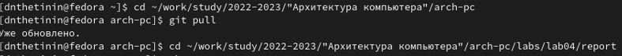
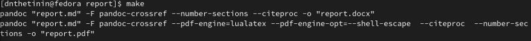
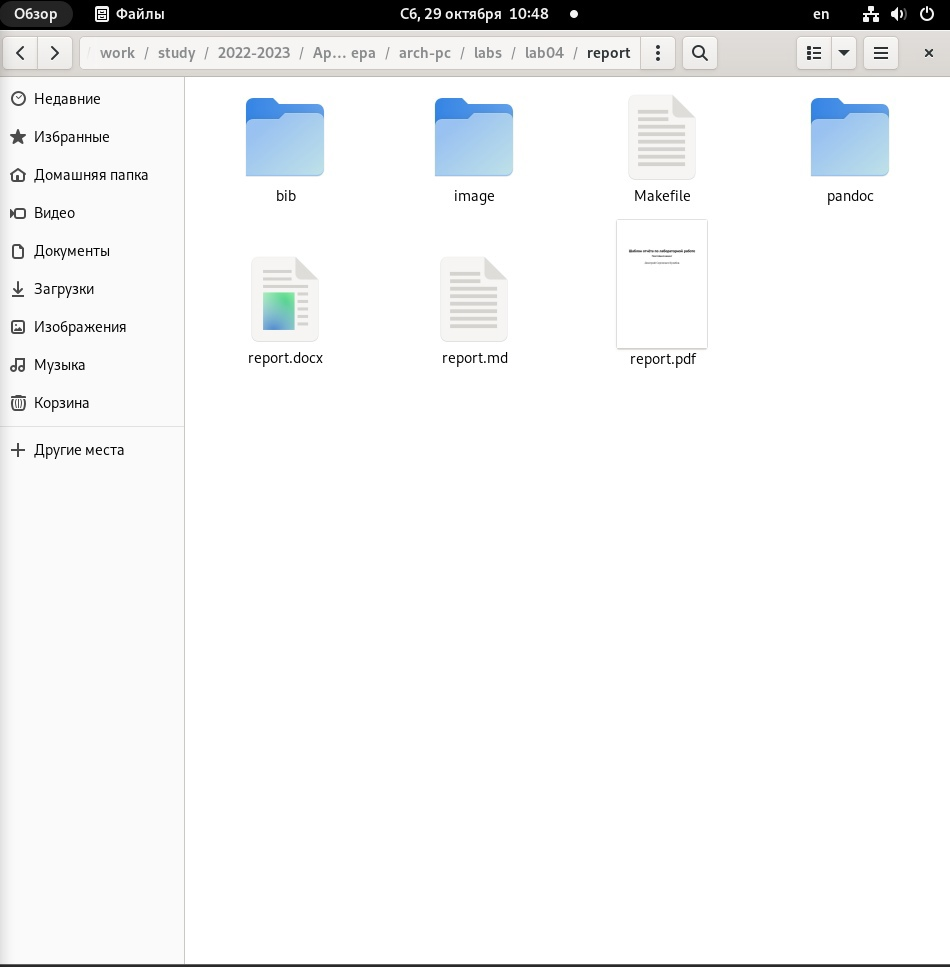
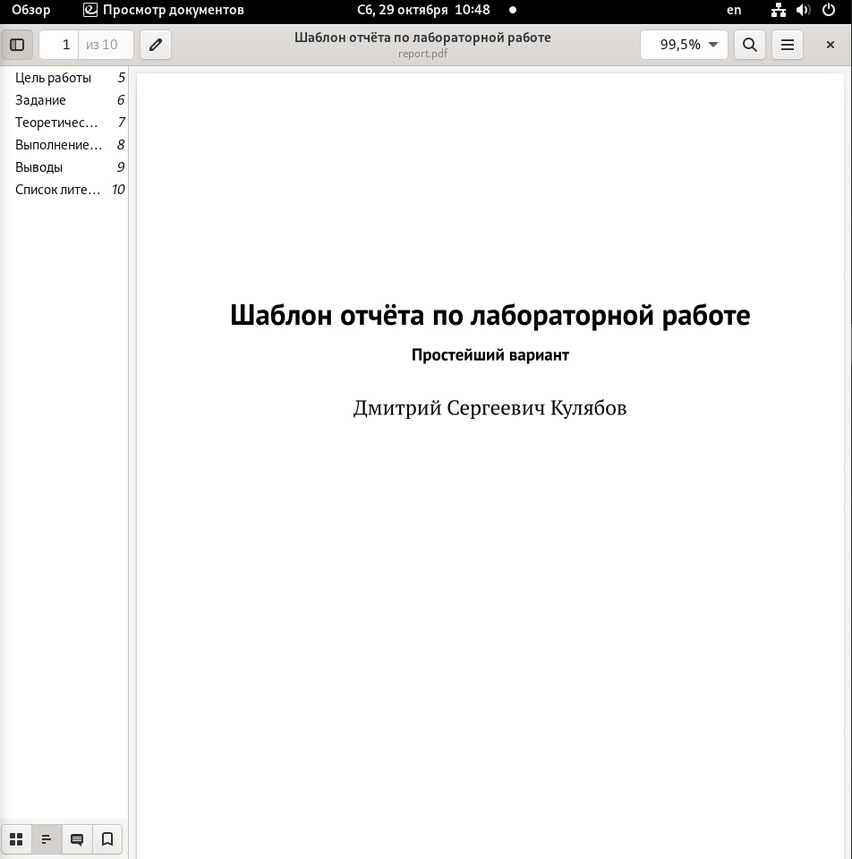
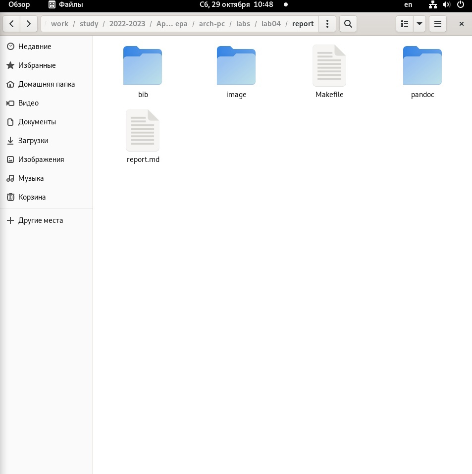
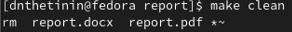
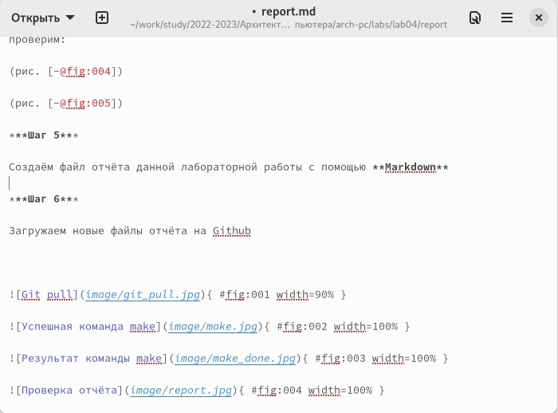

---
## Front matter
title: "Лабораторная работа №4"
author: "Даниил Николаевич Щетинин"

## Generic otions
lang: ru-RU
toc-title: "Содержание"

## Bibliography
bibliography: bib/cite.bib
csl: pandoc/csl/gost-r-7-0-5-2008-numeric.csl

## Pdf output format
toc: true # Table of contents
toc-depth: 2
lof: true # List of figures
fontsize: 12pt
linestretch: 1.5
papersize: a4
documentclass: scrreprt
## I18n polyglossia
polyglossia-lang:
  name: russian
  options:
	- spelling=modern
	- babelshorthands=true
polyglossia-otherlangs:
  name: english
## I18n babel
babel-lang: russian
babel-otherlangs: english
## Fonts
mainfont: PT Serif
romanfont: PT Serif
sansfont: PT Sans
monofont: PT Mono
mainfontoptions: Ligatures=TeX
romanfontoptions: Ligatures=TeX
sansfontoptions: Ligatures=TeX,Scale=MatchLowercase
monofontoptions: Scale=MatchLowercase,Scale=0.9
## Biblatex
biblatex: true
biblio-style: "gost-numeric"
biblatexoptions:
  - parentracker=true
  - backend=biber
  - hyperref=auto
  - language=auto
  - autolang=other*
  - citestyle=gost-numeric
## Pandoc-crossref LaTeX customization
figureTitle: "Рис."
tableTitle: "Таблица"
lofTitle: "Список иллюстраций"
## Misc options
indent: true
header-includes:
  - \usepackage{indentfirst}
  - \usepackage{float} # keep figures where there are in the text
  - \floatplacement{figure}{H} # keep figures where there are in the text
---

# Цель работы

Целью работы является освоение процедуры оформления отчетов с помощью
легковесного языка разметки Markdown.

# Задание

С помощью языка разметки Markdown оформить отчёт, скомпилировать и добавить в репозиторий Github

# Выполнение лабораторной работы

***Шаг 1*** 

Перейдём в наш рабочий каталог, и с помощью
```
git pull
```
Проверяем, что локальный репозиторий соответствует репозиторию на github 

(рис. [-@fig:001])

***Шаг 2***

С помощью команды  
```
make 
```
Создаём report.pdf и report.docx

(рис. [-@fig:002])

***Шаг 3*** 

Убедимся, что файлы созданы, откроем папку и проверим содержание файлов report.pdf и report.docx, и внимательно изучаем их. 

(рис. [-@fig:003])

(рис. [-@fig:004])

***Шаг 4***

Удаляем отчёты с помощью 
```
make clean
```
проверим:

(рис. [-@fig:004])

(рис. [-@fig:005])

***Шаг 5***

Создаём файл отчёта данной лабораторной работы с помощью **Markdown**

***Шаг 6***

Загружаем новые файлы отчёта на Github  


{ #fig:001 width=100% }

{ #fig:002 width=100% }

{ #fig:003 width=100% }

{ #fig:004 width=80% }

{ #fig:005 width=80% }

{ #fig:006 width=80% }

{ #fig:007 width=80% }


# Выводы

Мы успешно познакомились с языком разметки Markdown, командой Make, и смогли с помощью новых знаний создать отчёт 


