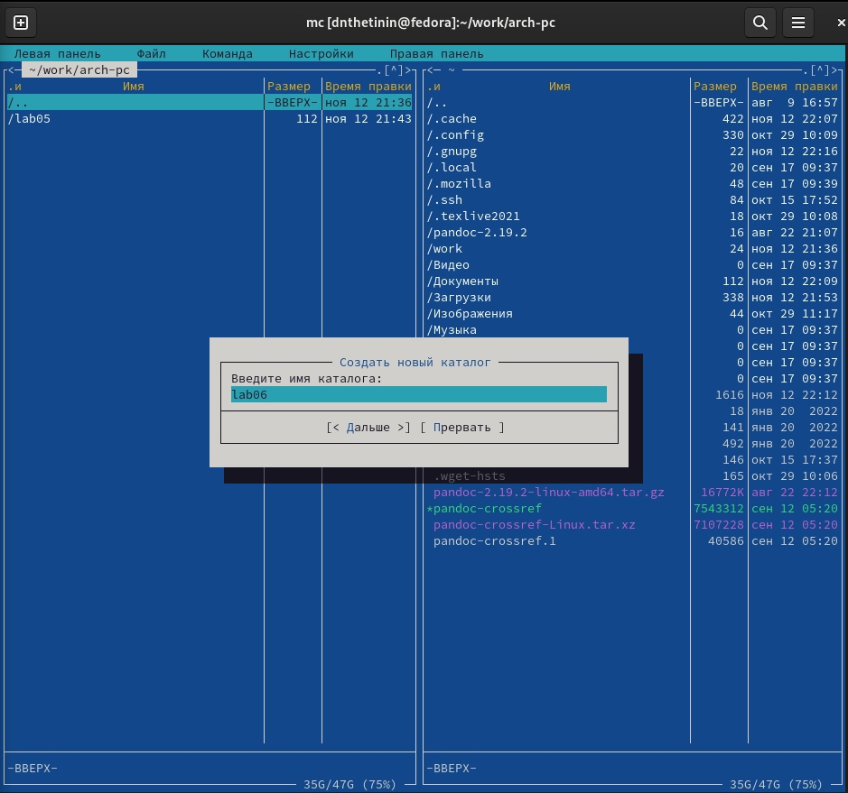
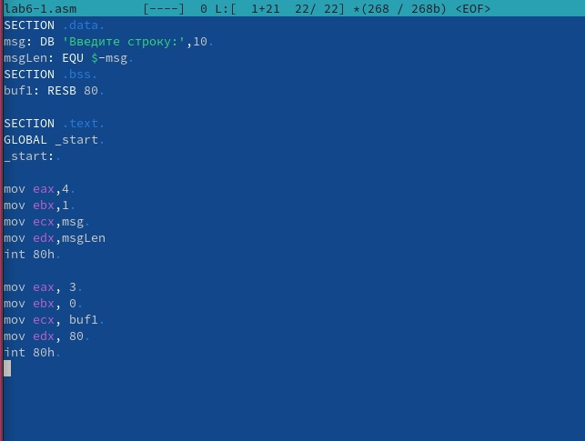
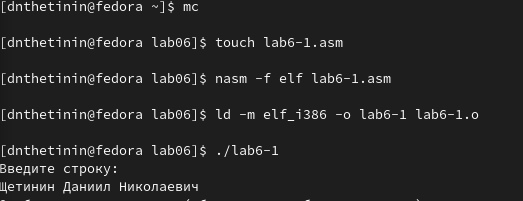
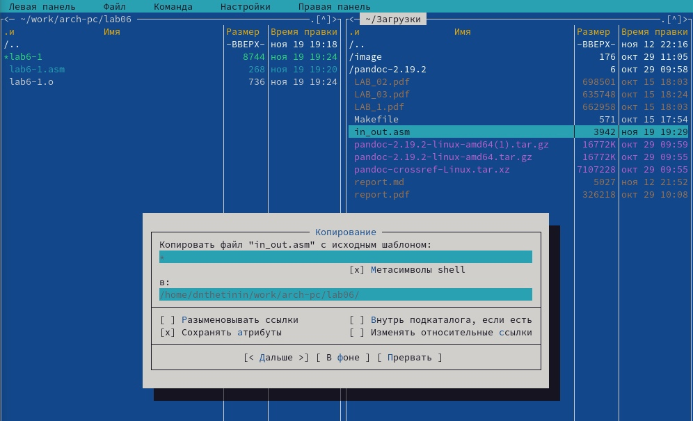
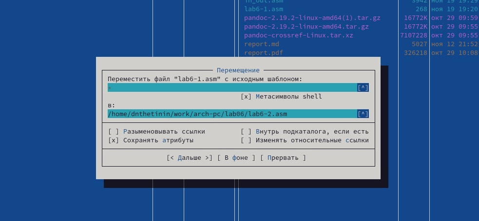
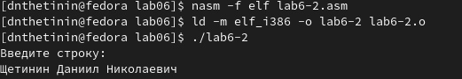
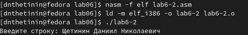
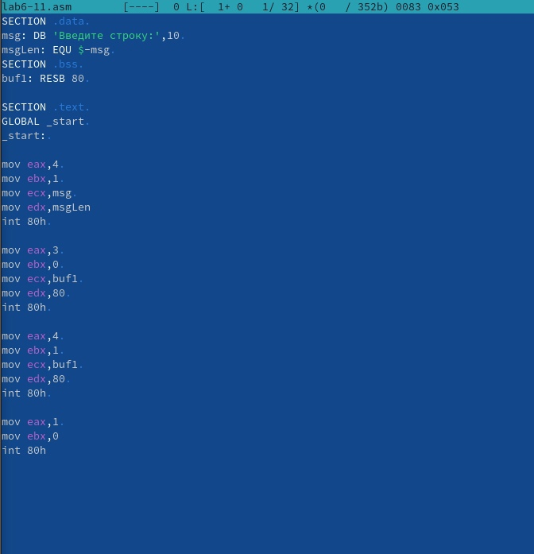
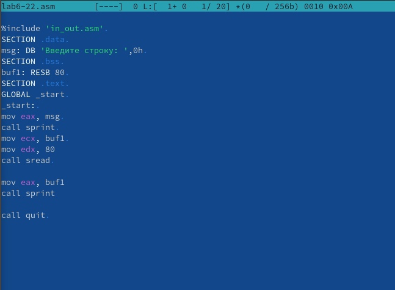

---
## Front matter
title: "Лабораторная работа №6"
author: "Щетинин Даниил Николаевич"

## Generic otions
lang: ru-RU
toc-title: "Содержание"

## Bibliography
bibliography: bib/cite.bib
csl: pandoc/csl/gost-r-7-0-5-2008-numeric.csl

## Pdf output format
toc: true # Table of contents
toc-depth: 2
lof: true # List of figures
fontsize: 12pt
linestretch: 1.5
papersize: a4
documentclass: scrreprt
## I18n polyglossia
polyglossia-lang:
  name: russian
  options:
	- spelling=modern
	- babelshorthands=true
polyglossia-otherlangs:
  name: english
## I18n babel
babel-lang: russian
babel-otherlangs: english
## Fonts
mainfont: PT Serif
romanfont: PT Serif
sansfont: PT Sans
monofont: PT Mono
mainfontoptions: Ligatures=TeX
romanfontoptions: Ligatures=TeX
sansfontoptions: Ligatures=TeX,Scale=MatchLowercase
monofontoptions: Scale=MatchLowercase,Scale=0.9
## Biblatex
biblatex: true
biblio-style: "gost-numeric"
biblatexoptions:
  - parentracker=true
  - backend=biber
  - hyperref=auto
  - language=auto
  - autolang=other*
  - citestyle=gost-numeric
## Pandoc-crossref LaTeX customization
figureTitle: "Рис."
tableTitle: "Таблица"
lofTitle: "Список иллюстраций"
## Misc options
indent: true
header-includes:
  - \usepackage{indentfirst}
  - \usepackage{float} # keep figures where there are in the text
  - \floatplacement{figure}{H} # keep figures where there are in the text
---

# Цель работы

Приобретение практических навыков работы в Midnight Commander. Освоение
инструкций языка ассемблера mov и int.

# Задание

Используя Midnight Commander (MC) и mov и int сделать базовые программы

# Выполнение лабораторной работы

**Шаг 1** 

Открываем Mc с помощью команды mc в терминале, перейдём в рабочий каталог и создадим каталог lab06, где мы будем проводить дальнейшую работу, также создадим (с помощью команды touch) файл lab6-1.asm, редактируем его

(рис. [-@fig:001])

**Шаг 2**

вводим в lab6-1.asm текст программы

(рис. [-@fig:002])

помощью клавиш F2, F3 сохраним изменения, проверим их наличие

**Шаг 3**

скомпилируем исполняемый файл и запустим получившийся файл:

(рис. [-@fig:003])

**Шаг 4**

Скопируем файл in_out.asm в каталог arch-pc с помощью клавиши F5

(рис. [-@fig:004])

Скопируем файл lab6-1.asm как lab6-2.asm с помощью клавиши F6

(рис. [-@fig:005])

**Шаг 5**

вводим в lab6-2.asm текст программы

(рис. [-@fig:006])

Выполним компоновку объектного файла и запустим получившийся исполняемый файл, а также заменим подпрограмму sprintLF на sprint:

(рис. [-@fig:007])

во втором файле отсутствует функция перевода строки после вывода сообщения на экран, поэтому введённое сообщение будет на одном уровне с "Введите строку:"  

# Задание для самостоятельной работы

**Шаг 1**

Копируем файл lab6-1.asm как lab6-11.asm и изменим его для того, чтобы на экран выводилась введённая строчка:

(рис. [-@fig:008])

Последний параграф отвечает за:

1 Системный вызов для записи

2 Стандартный вывод

3 Адрес строки buf1 (ранее введённое сообщение)

4 Длину строки 

После вызова инструкции int 80h на экране будет сообщение buf1, что и является введённым текстом 

(рис. [-@fig:010])

**Шаг 2**

скопируем lab6-2 как lab6-22:

(рис. [-@fig:009])

Здесь мы  вписываем наше сообщение в регистр eax и используем подпрограмму sprint для того чтобы вывести на экран введённое сообщение (buf1)

(рис. [-@fig:010])

{ #fig:001 width=90% }

{ #fig:002 width=100% }

{ #fig:003 width=100% }

{ #fig:004 width=70% }

{ #fig:005 width=100% }

{ #fig:006 width=100% }

{ #fig:007 width=100% }

{ #fig:008 width=100% }

{ #fig:009 width=100% }

{ #fig:010 width=100% }

# Выводы

Я смог использовать mc для навигации по системе, а также языки ассемблера mov и int для написания программ 
