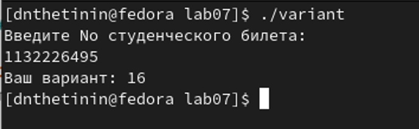

---
## Front matter
title: "Лабораторная работа №7"
author: "Щетинин Даниил Николаевич"

## Generic otions
lang: ru-RU
toc-title: "Содержание"

## Bibliography
bibliography: bib/cite.bib
csl: pandoc/csl/gost-r-7-0-5-2008-numeric.csl

## Pdf output format
toc: true # Table of contents
toc-depth: 2
lof: true # List of figures
fontsize: 12pt
linestretch: 1.5
papersize: a4
documentclass: scrreprt
## I18n polyglossia
polyglossia-lang:
  name: russian
  options:
	- spelling=modern
	- babelshorthands=true
polyglossia-otherlangs:
  name: english
## I18n babel
babel-lang: russian
babel-otherlangs: english
## Fonts
mainfont: PT Serif
romanfont: PT Serif
sansfont: PT Sans
monofont: PT Mono
mainfontoptions: Ligatures=TeX
romanfontoptions: Ligatures=TeX
sansfontoptions: Ligatures=TeX,Scale=MatchLowercase
monofontoptions: Scale=MatchLowercase,Scale=0.9
## Biblatex
biblatex: true
biblio-style: "gost-numeric"
biblatexoptions:
  - parentracker=true
  - backend=biber
  - hyperref=auto
  - language=auto
  - autolang=other*
  - citestyle=gost-numeric
## Pandoc-crossref LaTeX customization
figureTitle: "Рис."
tableTitle: "Таблица"
lofTitle: "Список иллюстраций"
## Misc options
indent: true
header-includes:
  - \usepackage{indentfirst}
  - \usepackage{float} # keep figures where there are in the text
  - \floatplacement{figure}{H} # keep figures where there are in the text
---

# Цель работы

Освоение арифметических инструкций языка ассемблера NASM.

# Задание

Написать программу вычисления функции, ознакомиться с Арифметическими операциями используя язык ассемблера NASM 

# Выполнение лабораторной работы

**Шаг 1** 

Создаём каталог для программам лабораторной работы No 7, и в нём создаём файл lab7-1.asm и переносим туда файл in_out.asm, копируем в него текст листинга 7.1, для того, чтобы ознакомиться с принципом вывода переменных на экран. Создаём исполняемый файл и получаем результат, символ 'j', т.к. код полученного нами элемента является кодом не для числа 10, а для символа 'j'

(рис. [-@fig:001])

**Шаг 2**

Изменим текст нашего файла, заменив 

```
mov eax,'6'
mov ebx,'4
```
на

```
mov eax,6
mov ebx,4
```

Получим 10 символ ASCII, который соответствует символу 'LF,/n', который не отображается на экране.

(рис. [-@fig:002])


**Шаг 3**

Создадим следующий файл, lab7-2.asm, где мы используем код из файла in_out.asm для преобразования ASCII символов в числа. Копируем код из листинга 7.2, запустим исполняемый файл, :

(рис. [-@fig:003])

Получим число 106, сумму кодов символов '4' и '6'

проделаем аналогичную работу с прошлым примером, заменив 

```
mov eax,'6'
mov ebx,'4
```
на

```
mov eax,6
mov ebx,4
```

и, запустив файл, получим число 10, сумму 4 и 6. 

(рис. [-@fig:004])

Также заменим в исходном файле функцию iprintLF на iprint, и увидим, что из-за этого строка не переводится после результата.

(рис. [-@fig:005])

**Шаг 4**

В новый файл lab7-3.asm введём текст из листинга 7.3, для нахождения выражения ((5∗2)+3)/3

Создаём файл и получаем ответ:

(рис. [-@fig:006])

Изменим код файла для вычисления выражения ((4∗6)+2)/5

(рис. [-@fig:007])

Результат:

(рис. [-@fig:008])

**Шаг 5**

вводим в variant.asm текст программы, проверяем его работу:

(рис. [-@fig:009])

Убедимся в правильности результата, разделим 1132226495 на 20 на калькуляторе, получим 56611324 целых, 15 в остатке, добавим к остатку 1, это равняется полученному номеру варианта

# Ответы на вопросы 1-7

1. 
переменная rem отвечает за сообщение 'Ваш вариант: '

```
rem: DB 'Ваш вариант: ',0
```
,
```
mov eax, msg

call sprintLF
```
Отвечает за вывод сообщения 'ваш вариант: [вариант]'

2. 

Данные функции используются для ввода значения переменной Х с клавиатуры и сохранения введенных данных 

3. 

Данная инструкция используется для преобразования кода символа ASCII в число

4. 

```
mov ebx,20
div ebx
inc edx
```

5. 

В регистр edx

6. 

Для увеличения значения edx на 1. 

7. 

Результат вычислений = номер варианта

```
mov eax,edx
call iprintLF
```

# Задание для самостоятельной работы

**Шаг 1**

Создадим файл var16.asm, в которой решим выражение (10*x-5)^2, в зависимости от различных Х. За основу возьмём Variant.asm 

Рассмотрим принцип работы нашего кода (Также см. Комментарии в самом коде) 

```
mov eax, msg 
call sprintLF 
mov ecx, x 
mov edx, 80 
call sread 
mov eax,x
call atoi 
```
отвечает за запись переменной Х
 
Далее, умножим Х (eax) на 10 (ebx)

вычтем из Х (eax) 5 

и умножим на Х (eax)

Запишем результат в edi, выведем на экран с помощью iprintLF

(рис. [-@fig:010])


{ #fig:001 width=90% }

{ #fig:002 width=100% }

{ #fig:003 width=100% }

{ #fig:004 width=70% }

{ #fig:005 width=100% }

{ #fig:006 width=100% }

{ #fig:007 width=100% }

{ #fig:008 width=100% }

{ #fig:009 width=100% }

{ #fig:010 width=100% }


# Выводы

Я смог написать базовую программу вычисления функции на языке ассемблера NASM
