---
## Front matter
title: "Лабораторная работа №8"
author: "Щетинин Даниил Николаевич"

## Generic otions
lang: ru-RU
toc-title: "Содержание"

## Bibliography
bibliography: bib/cite.bib
csl: pandoc/csl/gost-r-7-0-5-2008-numeric.csl

## Pdf output format
toc: true # Table of contents
toc-depth: 2
lof: true # List of figures
fontsize: 12pt
linestretch: 1.5
papersize: a4
documentclass: scrreprt
## I18n polyglossia
polyglossia-lang:
  name: russian
  options:
	- spelling=modern
	- babelshorthands=true
polyglossia-otherlangs:
  name: english
## I18n babel
babel-lang: russian
babel-otherlangs: english
## Fonts
mainfont: PT Serif
romanfont: PT Serif
sansfont: PT Sans
monofont: PT Mono
mainfontoptions: Ligatures=TeX
romanfontoptions: Ligatures=TeX
sansfontoptions: Ligatures=TeX,Scale=MatchLowercase
monofontoptions: Scale=MatchLowercase,Scale=0.9
## Biblatex
biblatex: true
biblio-style: "gost-numeric"
biblatexoptions:
  - parentracker=true
  - backend=biber
  - hyperref=auto
  - language=auto
  - autolang=other*
  - citestyle=gost-numeric
## Pandoc-crossref LaTeX customization
figureTitle: "Рис."
tableTitle: "Таблица"
lofTitle: "Список иллюстраций"
## Misc options
indent: true
header-includes:
  - \usepackage{indentfirst}
  - \usepackage{float} # keep figures where there are in the text
  - \floatplacement{figure}{H} # keep figures where there are in the text
---

# Цель работы

Изучение команд условного и безусловного переходов. Приобретение навыков написания программ с использованием переходов. Знакомство с назначением и структурой файла листинга.

# Задание

Ознакомиться с функциями языка NASM и написать программу для вычисления системы уравнений и наименьшего числа из 3 переменных

# Выполнение лабораторной работы

**Шаг 1** 

Создадим каталог для лабораторной работы 8, а также файл lab8-1.asm:

Введём в него текст из Листинга 8.1, для того чтобы понять принцип работы инструкции jmp

Создадим исполняемый файл и запустим его:

(рис. [-@fig:001])

Как мы видим, сообщение 1 нету в терминале, хотя оно присутствует в коде файла. Это потому, что использование инструкции jmp _label2 меняет порядок исполнения инструкций, и позволяет пропустить инструкцию. 

Изменим программу таким образом, чтобы она выводила сначала ‘Сообщение No 2’, потом ‘Сообщение No 1’ и завершала работу, введём текст из Листинга 8.2, и проверим работу файла:

(рис. [-@fig:002])

**Шаг 2**

Изменим код, чтобы сообщения выводились в порядке убывания, при этом только добавляя инструкцию jmp:

(рис. [-@fig:004])

(рис. [-@fig:005])

**Шаг 3**
Cоздим файл lab8-2.asm, и введем в него текст из Листинга 8.3, для того чтобы найти меньшее из 3 чисел, два из которых заданы программой. 

Проверим его работу для различных B:

(рис. [-@fig:006])

**Шаг 4**

Создадим файл листинга для программы из предыдущего файла, для этого используем ключ -l в команде nasm, и откроем его, чтобы ознакомиться с содержимым. Рассмотрим 3 строчки для примера структуры листинга:

(рис. [-@fig:007])

```
38 0000013F 8B0D[00000000]          mov ecx,[max]
39 00000145 3B0D[0A000000]          cmp ecx,[B] ; Сравниваем 'max(A,C)' и 'B'
40 0000014B 7F0C                    jg fin ; если 'max(A,C)>B', то переход на 'fin',
```

38, 39, 40 отвечают за номер строки;

00000... - адрес, он отвечает за то, чтобы инструкции выполнялись по порядку; 

8B0D, 3B0D, 7F0C - машинный код, инструкция на машинном языке, они отвечают за перемещение переменной max в ecx, сравнение ecx и B, и переход к 'fin' если ecx больше B соответственно;

Справа находится исходный текст нашей программы. 

Допустим ошибку в нашем коде, удалим один операнд в операции, требующей два, создадим файл листинга, lab8-2.lst и посмотрим как он изменился:

(рис. [-@fig:008])

Как мы видим, в файле листинга около строчки кода находится предупреждение об ошибке. 

# Задание для самостоятельной работы

**Шаг 1**

Создадим файл lab8-3.asm для создания программы для нахождения наименьшей из 3 переменных a,b,c, за основу взяв код lab8-2.asm

Как в листинге 8.2, мы поочерёдно записываем с клавиатуры 3 переменные, переводим их в числа (необязательно)

Далее можно просто оставить код Листинга 8.3, заменив jg (переход если больше) на jl (переход если меньше) (Также См комментарии в коде)

(рис. [-@fig:009])

(рис. [-@fig:010])

Проверяем:

(рис. [-@fig:011])

Создадим файл lab8-4.asm для создания программы нахождения ответа на систему уравнений с использованием 2 переменных a,х за основу снова взяв код lab8-2.asm

Как и указано в комментариях, мы записываем введённые значения а и х в переменные А и Х поочерёдно, преобразуем их в числа для работы с операциями сложения и умножения,  и сравниваем Х и 4.

Если Х < 4 то мы переходим к Хmin, и решаем уравнение x + 4, выводим результат, в противном случае умножаем а на х и переходим в конец, где мы выводим сообщение 'Ответ: ' на экран

Код
(рис. [-@fig:012])

(рис. [-@fig:013])

Проверим

(рис. [-@fig:014])

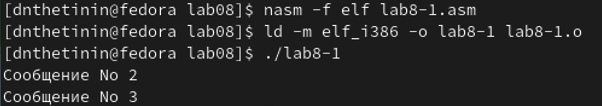{ #fig:001 width=90% }

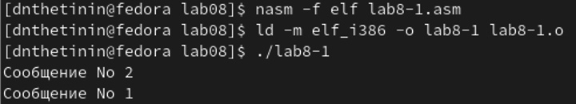{ #fig:002 width=100% }

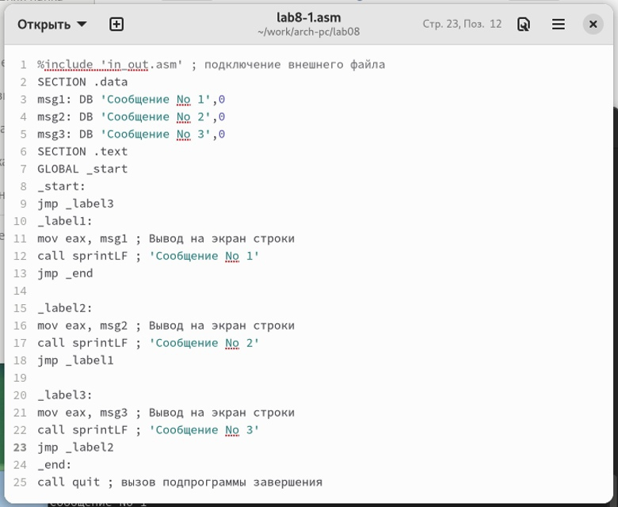{ #fig:004 width=70% }

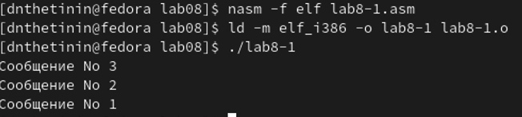{ #fig:005 width=100% }

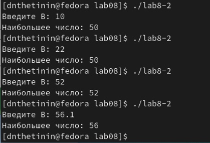{ #fig:006 width=100% }

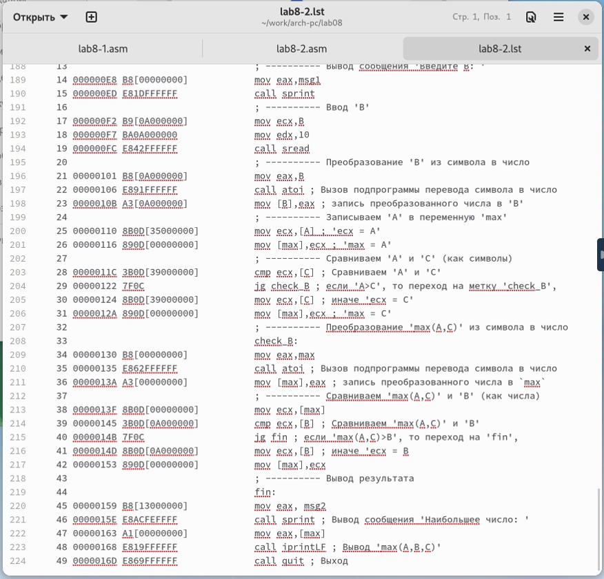{ #fig:007 width=100% }

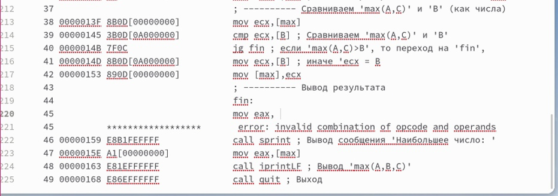{ #fig:008 width=100% }

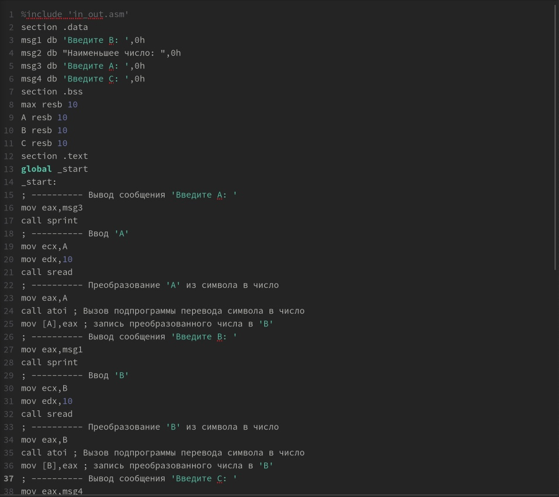{ #fig:009 width=100% }

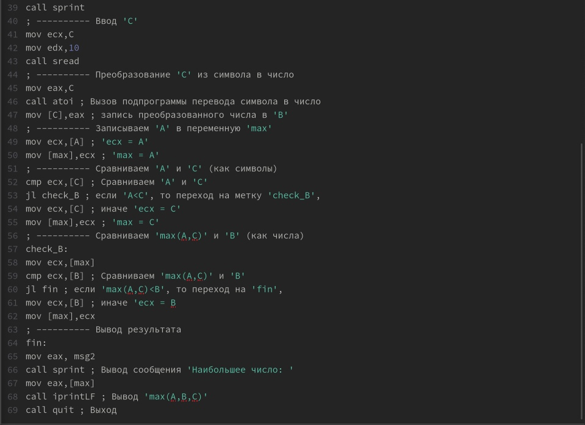{ #fig:010 width=100% }

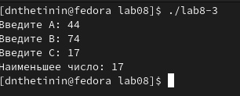{ #fig:011 width=100% }

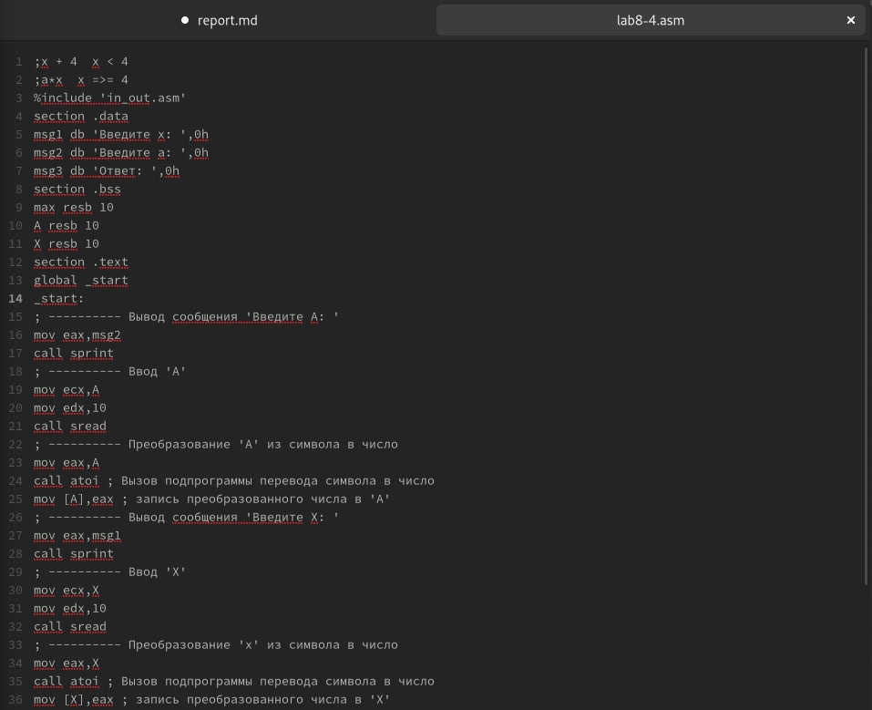{ #fig:012 width=100% }

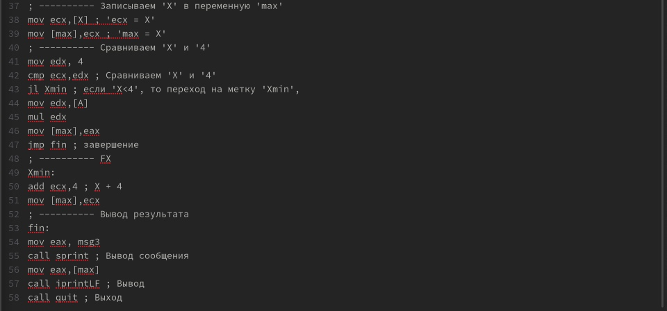{ #fig:013 width=100% }

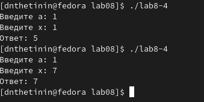{ #fig:014 width=100% }

# Выводы

Я успешно изучил команды переходов, приобрёл навыки написания программ с ними и ознакомился с назначением и структурой файла листинга.
