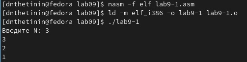
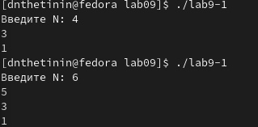
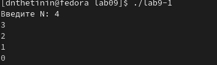
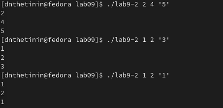
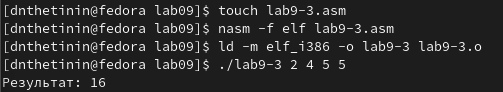
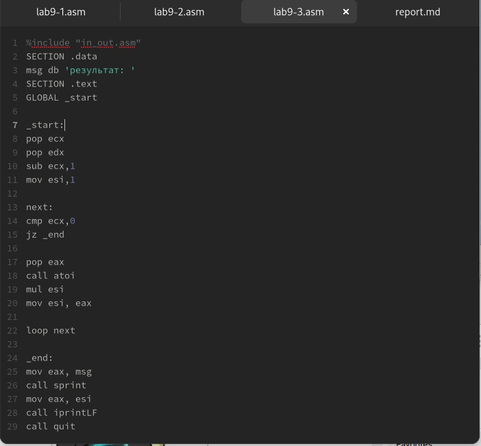
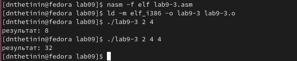
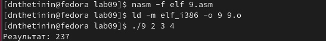
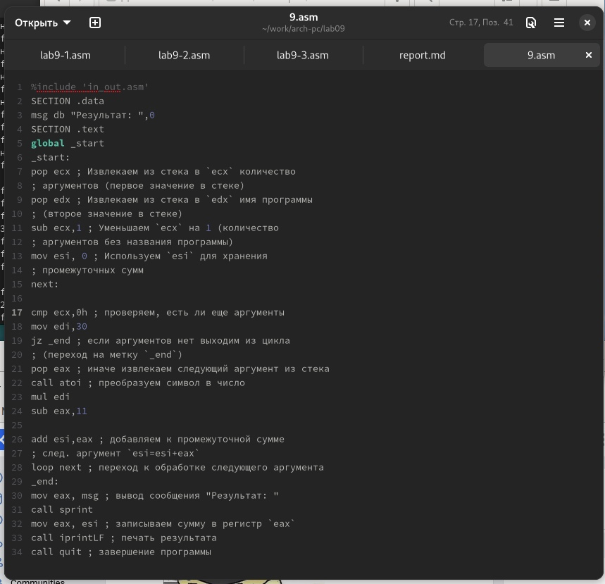

---
## Front matter
title: "Лабораторная работа №9"
author: "Щетинин Даниил Николаевич"

## Generic otions
lang: ru-RU
toc-title: "Содержание"

## Bibliography
bibliography: bib/cite.bib
csl: pandoc/csl/gost-r-7-0-5-2008-numeric.csl

## Pdf output format
toc: true # Table of contents
toc-depth: 2
lof: true # List of figures
fontsize: 12pt
linestretch: 1.5
papersize: a4
documentclass: scrreprt
## I18n polyglossia
polyglossia-lang:
  name: russian
  options:
	- spelling=modern
	- babelshorthands=true
polyglossia-otherlangs:
  name: english
## I18n babel
babel-lang: russian
babel-otherlangs: english
## Fonts
mainfont: PT Serif
romanfont: PT Serif
sansfont: PT Sans
monofont: PT Mono
mainfontoptions: Ligatures=TeX
romanfontoptions: Ligatures=TeX
sansfontoptions: Ligatures=TeX,Scale=MatchLowercase
monofontoptions: Scale=MatchLowercase,Scale=0.9
## Biblatex
biblatex: true
biblio-style: "gost-numeric"
biblatexoptions:
  - parentracker=true
  - backend=biber
  - hyperref=auto
  - language=auto
  - autolang=other*
  - citestyle=gost-numeric
## Pandoc-crossref LaTeX customization
figureTitle: "Рис."
tableTitle: "Таблица"
lofTitle: "Список иллюстраций"
## Misc options
indent: true
header-includes:
  - \usepackage{indentfirst}
  - \usepackage{float} # keep figures where there are in the text
  - \floatplacement{figure}{H} # keep figures where there are in the text
---

# Цель работы

Приобретение навыков написания программ с использованием циклов и обработкой аргументов командной строки.

# Задание

Изучить циклы в НАСМ и написать программу вычисления функций

# Выполнение лабораторной работы

**Шаг 1** 

Создадим каталог для лабораторной работы 9, а также файл lab9-1.asm:

Введём в него текст из Листинга 9.1, для того чтобы понять принцип работы инструкции loop

Создадим исполняемый файл и запустим его:

{ #fig:001 width=90% }

Как мы видим, программа выдала 

Изменим программу таким образом, чтобы она была ошибка, из-за которой два раза подряд уменьшался параметр Н и проверим работу файла:

{ #fig:002 width=100% }

Как мы видим, файл пропускает некоторые значения Н из-за некорректного кода

**Шаг 2**

еще раз изменим код, чтобы Н корректно уменьшалось каждый цикл, при этом Н = числу циклов 

{ #fig:004 width=70% }

**Шаг 3**
Создадим файл lab9-2.asm, и введем в него текст из Листинга 9.2, для того чтобы поочерёдно выводить аргументы на экран

Проверим его работу для различных аргументов, в том числе с кавычками:

{ #fig:005 width=100% }

**Шаг 4**

создадим файл lab9-3.asm, и введем в него текст из Листинга 9.3, для нахождения суммы аргументов, проверим работу

{ #fig:006 width=100% }

Изменим файл таким образом, чтобы вместо суммы мы искали произведение: просто в каждом цикле умножим еах на еsi и перенесём значение eax в esi

{ #fig:007 width=100% }

{ #fig:008 width=100% }

# Задание для самостоятельной работы

**Шаг 1**

Создадим файл 9.asm для создания программы для нахождения функции за основу взяв код lab9-3.asm

как и в лаб9-3 мы каждый цикл просто умножаем х на 30 и вычитаем 11, записываем все в esi

проверим работу

{ #fig:011 width=100% }

{ #fig:012 width=100% }

# Выводы

Я смог успешно написать код для вычисления функции ф(х)
